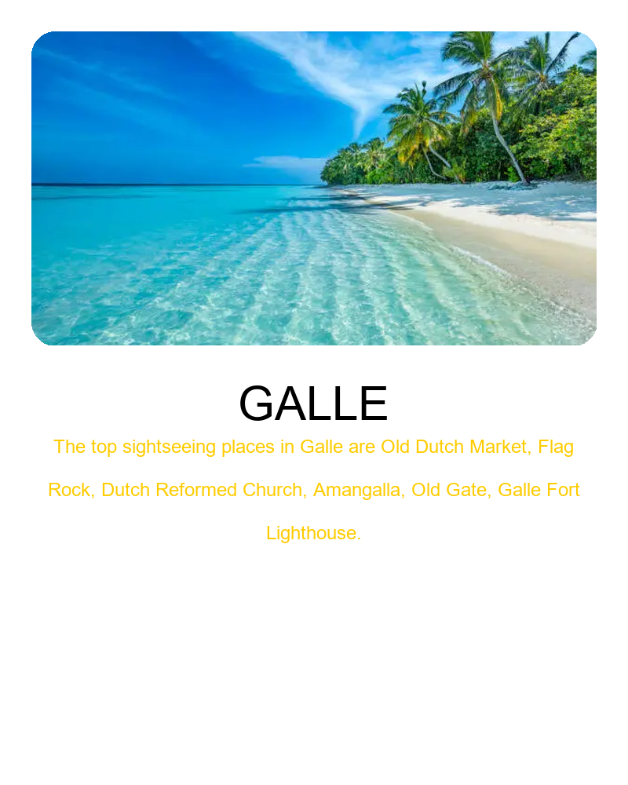

# Galle Card Generator 🏖️

A Python-based destination card generator that creates beautiful, customizable cards for Galle, Sri Lanka featuring beach imagery.



## Technologies Used

- Python 3
- PIL (Pillow) - Image processing library
- ImageDraw - Drawing graphics
- ImageFont - Font rendering

## Project Structure
```
GalleCardProject/
├── galle_card.py
├── assets/
│   └── beach_pic_1.png
├── galle_card.png (generated output)
└── README.md
```

## Features

- ✨ Generates professional destination cards
- 🖼️ Custom beach image integration with rounded corners
- 🎨 Two positioning modes: "cover" and "contain"
- 📝 Customizable text and descriptions
- 🎯 Configurable image alignment options

## Setup and Usage

### Prerequisites

Make sure you have Python installed on your system.

### Installation

1. Clone the repository or download the files
```bash
git clone https://github.com/Dinushisarah/GalleCard_2nd.git
cd GalleCard_2nd
```

2. Install required dependencies
```bash
pip install pillow
```

3. Add your beach image to the `assets` folder as `beach_pic_1.png`

### Running the Script
```bash
python galle_card.py
```

The generated card will be saved as `galle_card.png` in the project directory.

## Configuration

You can customize the card by editing these variables at the top of `galle_card.py`:

- **IMAGE_MODE**: Choose between "cover" (fill entire area) or "contain" (fit entire image)
- **IMAGE_POSITION**: Set position for contain mode (center, top, bottom, left, right, etc.)
- **CROP_ALIGNMENT**: Set crop alignment for cover mode (center, top, bottom)

## Output

The script generates an 800x1000px card with:
- Beach image with rounded corners (400px height)
- "GALLE" title in bold
- Sightseeing places description in gold text

## License

This project is open source and available for educational purposes.

## Author

Created by Dinushi Sarah